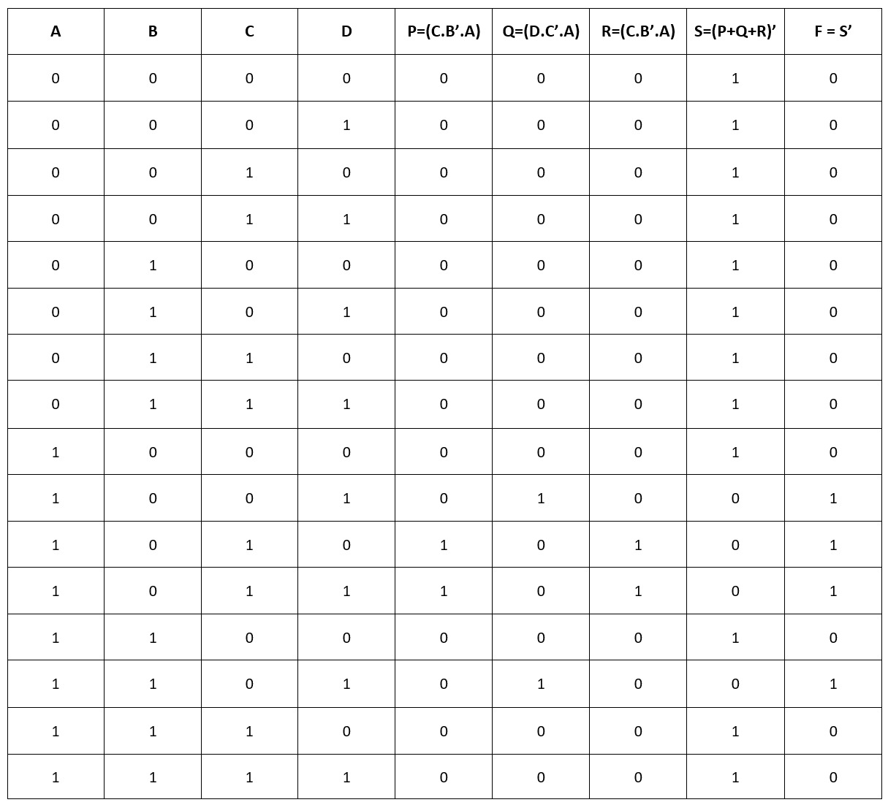

# Experiment--04-Implementation-of-combinational-logic-using-universal-gates-
 ## Implementation-of-Half-subtractor-and-Full-subtractor-circuit
## AIM:
To implement the given logic function using NAND and NOR gates and to verify its operation in Quartus using Verilog programming.
### F=((C'.B.A)'(D'.C.A)'(C.B'.A)')' using NAND gate
### F=(((C.B'.A)+(D.C'.A)+(C.B'.A))')' using NOR gate

## Equipments Required:
### Hardware – PCs, Cyclone II , USB flasher
### Software – Quartus prime
## Theory:
 A universal gate is a logic gate which can implement any Boolean function without the need to use any other type of logic gate. The NOR gate and NAND gate are universal gates. This means that you can create any logical Boolean expression using only NOR gates or only NAND gates. 
In practice, this is advantageous since NOR and NAND gates are economical and easier to fabricate than other logic gates.
 Similarly, an OR gate is typically realised as a NOR gate followed by an inverter.
 
## Procedure:
### STEP 1:
Create a project with required entities.
### STEP 2:
Create a module along with respective file name.
### STEP 3:
Run the respective programs for the given boolean equations.
### STEP 4:
Run the module and get the respective RTL outputs.
### STEP 5:
Create university program(VWF) for getting timing diagram.
### STEP 6:
Give the respective inputs for timing diagram and obtain the results.   
## Program:
~~~
Program to design a Implementation of combinational logic using universal gates-  and verify its truth table in quartus using Verilog programming.
Developed by: G.Pavithra
RegisterNumber:  212221240036
~~~
### F=((C'.B.A)'(D'.C.A)'(C.B'.A)')' using NAND gate:
### code:
~~~
module newpro(A,B,C,D,F);
input A,B,C,D;
output F;
wire F1,F2,F3;
assign F1 = C&(~B)&(~A);
assign F2 = D&(~C)&(~A);
assign F3 = (~C)&B&(~A);
assign F = (~F1&~F2&~F3);
endmodule
~~~
### F=(((C.B'.A)+(D.C'.A)+(C.B'.A))')' using NOR gate:
### code:
~~~
module newpro1(A,B,C,D,F);
input A,B,C,D;
output F;
wire P,Q,R,S;
assign P = C&(~B)&A;
assign Q = D&(~C)&A;
assign R = C&(~B)&A;
assign S = ~(P|Q|R);
not(F,S);
endmodule
~~~
## Output:

## NAND GATE:
## Truthtable:

##  RTL realization:

## Timing diagram: 

## NOR GATE:
## Truthtable:

##  RTL realization:

## Timing diagram: 

## Result:
 Implementation of the given logic function using NAND and NOR gates is done and verification its operation in Quartus using Verilog programming is carried out sucessfully.